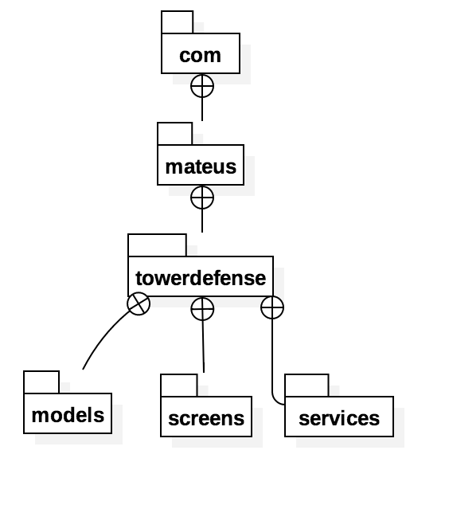
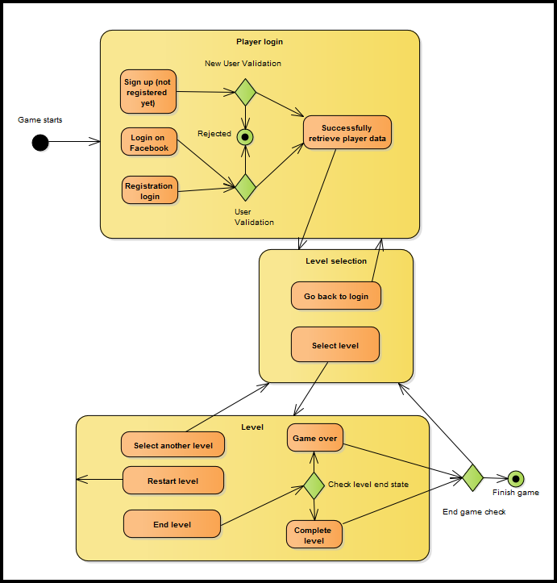
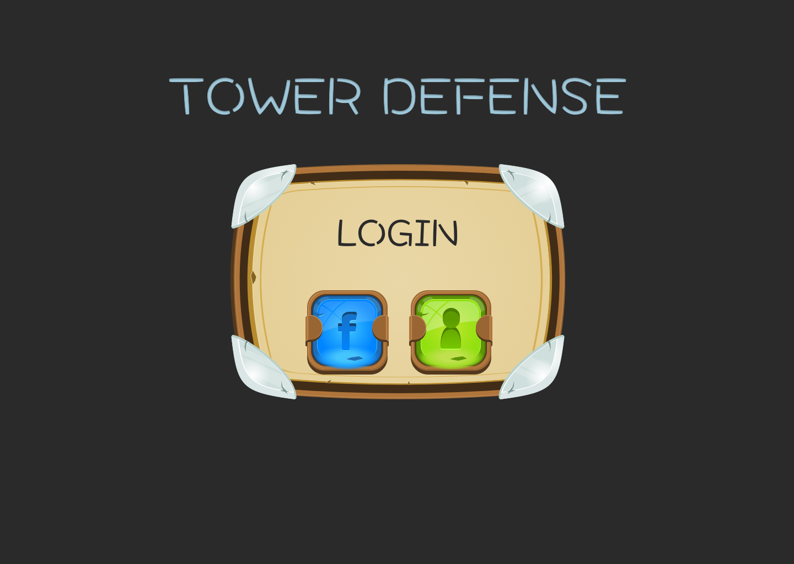
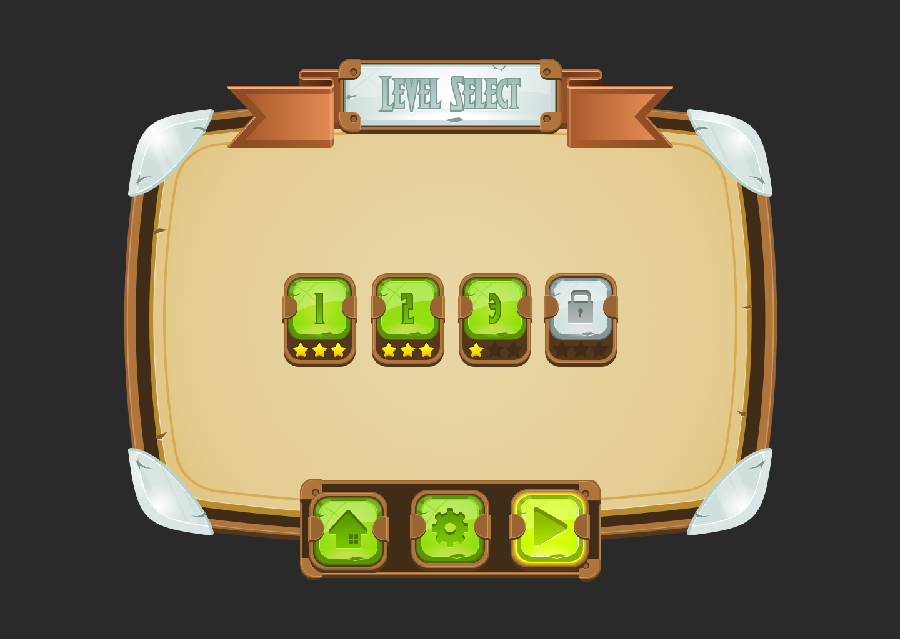
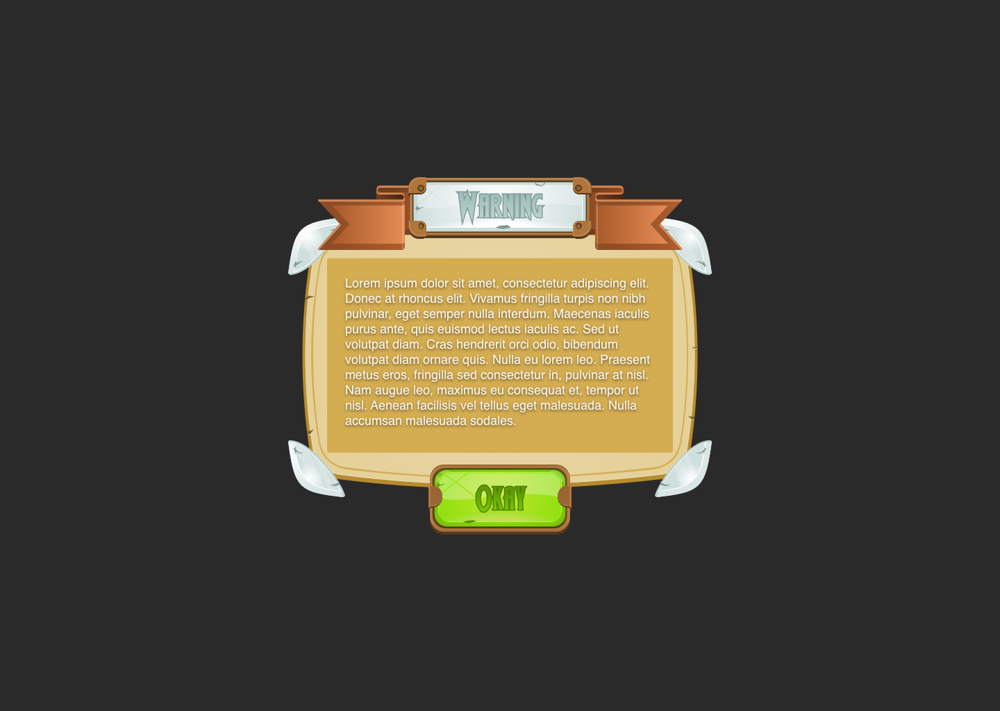

# TOWER DEFENSE - Mateus Pedroza - up201601876

 Final Project Intermediate Check-Point

## Architeture Design
#### Package and class diagram (UML)
##### Package

##### Class

#### Design of behavioural aspects
##### Player behaviour

#### Design Patterns

## GUI Design

### Identification / Listing of the main functionalities

* Initial: Allows player to login.
* Login: Player can choose to login or sign up.
* Level selection: Player can choose available levels, playable levels need to be unlocked. Menu bar with options to go back to login screen, configure game and play selected level.
* Game: Menu with options to go back to level selection screen or restart level. Bar showing crystal health, wave number and player gold.
* Finished: Shows the achieved score, remaining crystal health and gold. Menu bar with options to go back to login screen, level selection screen, restart level or play next level.
* Alert: Default alert presentation, shown if player entered an invalid e-mail address for example.

### GUI Mock-ups

#### Initial

#### Login

#### Sign Up

#### Level selection

#### Game Screen

#### Level Finished Alert

#### Alert

## Test design 

#### Expected final test cases
- test_game_begin(): 
>Check if game started successfully.
- test_game_ended(): 
>Check if game ended successfully.
- test_player_selected_buildable_area(): 
>Check if game only allow player to build towers in buildable areas.
- test_player_area_selection_animation(): 
>Check if area selection animation is being presented without errors.
- test_player_build_tower(): 
>Check if player built a tower with success.
- test_player_upgraded_tower(): 
>Check if player upgraded a tower with success.
- test_player_deleted_tower(): 
>Check if player deleted a tower with success.
- test_tower_attack(): 
>Check if tower is attacking nearby monsters and if he is receiving damage.
- test_monster_path(): 
>Check if monster is moving in it’s path.
- test_monster_crystal_attack(): 
>Check if monster is attacking the crystal after moving.
- test_monster_destroyed_crystal():
>Check if monster destroyed the crystal.
- test_monster_killed(): 
>Check if monster is killed by tower with success.
- test_monster_animation(): 
>Check if monster animation is being presented without errors.
