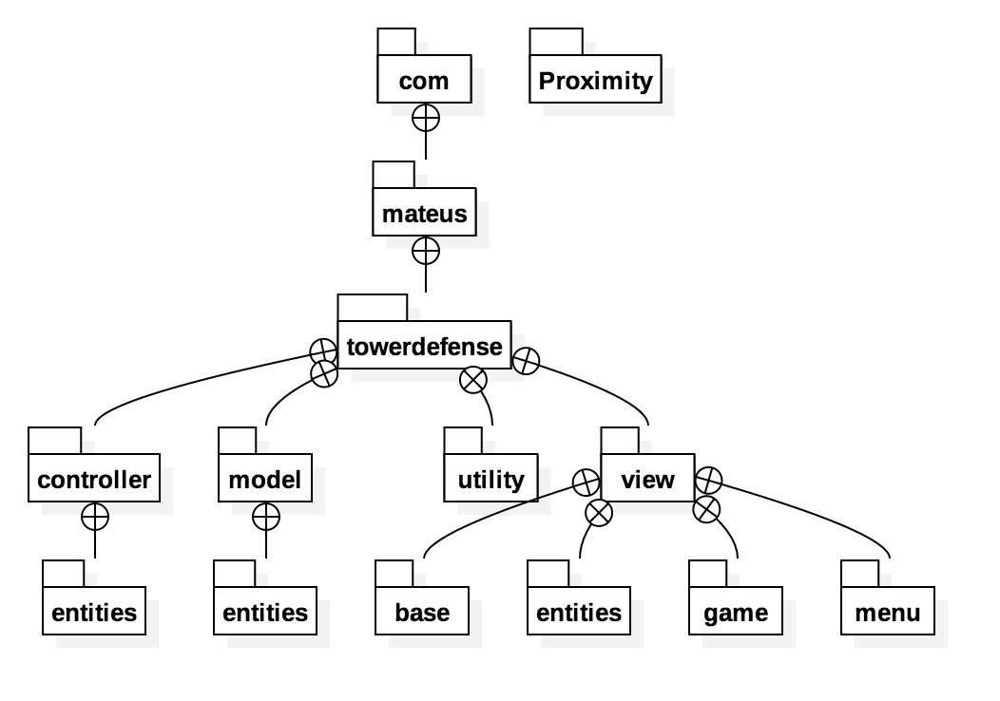

# Tower Defense
## Mateus Pedroza Cortes Marques - up201601876

### Documentation:
    Documentation is at "doc" folder.
    
### Unit tests:
    The unit test class is on /tests/ folder.
    
### Setup:
##### Executable:
The game executable is in the root folder, download this repository and execute <b>"TowerDefense.jar"</b> to play.
    
### Development Documentation:

##### Implementations:
* Libgdx as the main framework.
* Box2d to handle the game physics.
* Libgdx-AI to handle the artificial intelligence.

##### Package structure:

##### Type Hierarchy:

##### Design patterns used:
    The game was developed in the MVC arquitecture. 
    All actors were divided between a model, a controller that handles physics an AI, and the view.
    For utility functions I used static classes with static functions.

##### Major difficulties:
    The major difficulty and the most painfull thing to work on was Libgdx-AI, it took me a lot of time to get it going since the documentation is horrible with no examples and most of the things you have to discover by reverse engineering.
    
##### Overall time spent developing:
    Since I made it all by myself, I didn't keep tracking, but it was almost all the time in the last weeks, so I think more than 100/200 hours.
    
##### Distribution among team members:
    I made it all by myself.
    